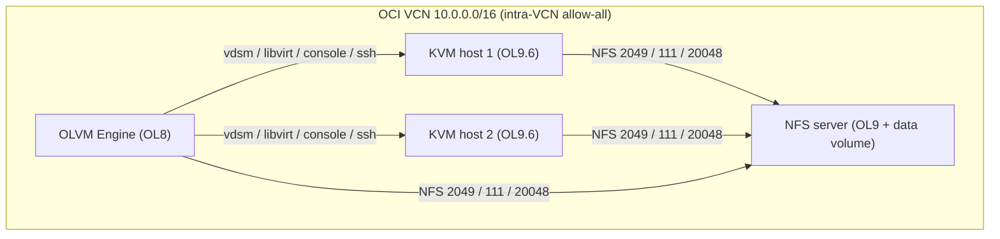

# OLVM platform (merged stack)

One self-contained project that provisions the infrastructure and configures a
complete Oracle Linux Virtualization Manager (OLVM) 4.5 lab on OCI:

- **1 OLVM Engine** (Oracle Linux 8) - the machine OLVM is installed on
- **2 KVM hosts** (Oracle Linux 9.6+) - hypervisors that run the VMs
- **1 NFS storage server** (Oracle Linux 9) - exports an OLVM storage domain

All internal ports needed for the machines to communicate are opened at both the
cloud (OCI security list) and host (firewalld) layers.

This folder merges four previously separate projects, which remain untouched:

| Merged from | Into |
|-------------|------|
| `../linux-ol8` (Terraform, OL8 Engine VM) | `terraform/` (the `engine` VM) |
| `../terraform-linux-day1` (Terraform, multi-VM base) | `terraform/` (multi-VM `vms` map, block volume) |
| `../install-olvm` (Ansible, Engine install) | `ansible/roles/olvm_engine` |
| `../setup-hosts-olvm` (Ansible, KVM host prep) | `ansible/roles/olvm_host_prep` |
| *(new)* NFS storage server | `terraform/` (the `nfs` VM) + `ansible/roles/nfs_server` |

## Layout

```
olvm-platform/
  terraform/     # one OCI stack -> 4 VMs + shared VCN/subnet/security list + NFS volume
  ansible/       # one project  -> nfs_server + olvm_engine + olvm_host_prep, single site.yml
  README.md
```

## Architecture



## End-to-end workflow

### 1. Provision the infrastructure

```sh
cd terraform
cp terraform.tfvars.example terraform.tfvars   # fill in OCI credentials
terraform init
terraform apply
```

This creates the 4 VMs, shared networking, the NFS data volume, and one SSH key
in `terraform/generated/`.

### 2. Build the Ansible inventory

```sh
terraform output ansible_inventory_hint
terraform output -raw nfs_private_ip

cd ../ansible
cp inventory/hosts.yml.example inventory/hosts.yml
# set ansible_host per VM, target_hostname per KVM host, nfs_server_address
```

### 3. Configure everything

```sh
ansible-galaxy collection install -r requirements.yml
echo 'YourVaultPassphrase' > .vault_pass         # Engine admin password vault
ansible-playbook site.yml --limit nfs_server     # 1) NFS storage
ansible-playbook site.yml --limit engine         # 2) OLVM Engine

# copy the Engine's generated SSH public key into group_vars/kvm_hosts.yml, then:
ansible-playbook site.yml --limit kvm_hosts      # 3) KVM host prep
```

Or run `ansible-playbook site.yml` for all three tiers once
`engine_ssh_public_key` is set. See [`ansible/README.md`](ansible/README.md) for
the vault and Engine-key details.

### 4. Finish in the OLVM Admin Portal (manual)

- Compute > Hosts > New: add each KVM host by its private IP.
- Storage > Domains > New Domain: NFS data domain at `<nfs_private_ip>:/exports/olvm`.

## Internal ports enabled for machine-to-machine communication

Opened at both layers so the requirement "enable all internal ports required for
communication between these machines" is satisfied regardless of which layer you
rely on.

**OCI security list** (`terraform/network.tf`):

| Scope | Rule |
|-------|------|
| External (`ssh_allowed_cidr`) | TCP 22, 80, 443, and 5900-6923 |
| Internal (`vcn_cidr_block`) | **all protocols/ports** between machines (`allow_all_intra_vcn = true`) |
| Egress | all |

**Host firewalld** (Ansible), in addition to trusting the whole VCN CIDR:

| Host | Ports opened |
|------|--------------|
| KVM hosts (`olvm_host_prep`) | 22, 54321, 54322, 5900-6923, 49152-49216, 16509, 16514 (tcp) + trust VCN |
| NFS server (`nfs_server`) | 2049, 111, 20048 (tcp+udp), services nfs/rpc-bind/mountd + trust VCN |
| Engine (`olvm_engine`) | configured by `engine-setup` (firewalld) + covered by the intra-VCN rule |

To rely only on per-host firewalld rules, set `allow_all_intra_vcn = false` in
`terraform.tfvars`.

## Notes

- The Engine must run Oracle Linux 8 (OLVM 4.5 requirement); the KVM hosts and
  NFS server run Oracle Linux 9. This is expressed per VM via
  `oracle_linux_version` in the `vms` map.
- Only the NFS server gets a data volume (set via `data_volume_size_in_gbs`).
- The NFS export is owned by uid:gid 36:36 (vdsm:kvm) and exported with
  `no_root_squash`, as OLVM storage domains require.
- Adding hosts and the storage domain to the Engine stay manual Admin Portal
  steps, matching the original projects' scope.
