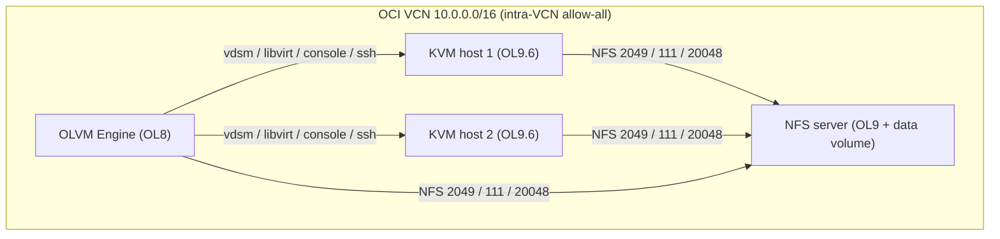

# OLVM platform (merged stack)

One self-contained project that provisions the infrastructure and configures a
complete Oracle Linux Virtualization Manager (OLVM) 4.5 lab on OCI:

- **1 OLVM Engine** (Oracle Linux 8) - the machine OLVM is installed on
- **2 KVM hosts** (Oracle Linux 9.6+) - hypervisors that run the VMs
- **1 NFS storage server** (Oracle Linux 9) - exports an OLVM storage domain

All internal ports needed for the machines to communicate are opened at both the
cloud (OCI security list) and host (firewalld) layers.

This folder merges four previously separate projects, which remain untouched:

| Merged from | Into |
|-------------|------|
| `../linux-ol8` (Terraform, OL8 Engine VM) | `terraform/` (the `engine` VM) |
| `../terraform-linux-day1` (Terraform, multi-VM base) | `terraform/` (multi-VM `vms` map, block volume) |
| `../install-olvm` (Ansible, Engine install) | `ansible/roles/olvm_engine` |
| `../setup-hosts-olvm` (Ansible, KVM host prep) | `ansible/roles/olvm_host_prep` |
| *(new)* NFS storage server | `terraform/` (the `nfs` VM) + `ansible/roles/nfs_server` |

## Layout

```
olvm-platform/
  terraform/     # one OCI stack -> 4 VMs + shared VCN/subnet/security list + NFS volume
  ansible/       # one project  -> nfs_server + olvm_engine + olvm_host_prep, single site.yml
  scripts/       # optional standalone helpers (e.g. upload a disk/ISO to a storage domain)
  README.md
```

## Architecture



## End-to-end workflow

### 1. Provision the infrastructure

```sh
cd terraform
cp terraform.tfvars.example terraform.tfvars   # fill in OCI credentials
terraform init
terraform apply
```

This creates the 4 VMs, shared networking, the NFS data volume, and one SSH key
in `terraform/generated/`.

### 2. Build the Ansible inventory

```sh
terraform output ansible_inventory_hint
terraform output -raw nfs_private_ip

cd ../ansible
cp inventory/hosts.yml.example inventory/hosts.yml
# set ansible_host per VM, target_hostname + host_address (private IP) per KVM
# host, and nfs_server_address on the NFS server
```

### 3. Configure everything

```sh
ansible-galaxy collection install -r requirements.yml
echo 'YourVaultPassphrase' > .vault_pass         # Engine admin password vault
ansible-playbook site.yml --limit nfs_server     # 1) NFS storage
ansible-playbook site.yml --limit engine         # 2) OLVM Engine
ansible-playbook site.yml --limit kvm_hosts      # 3) KVM host prep
```

The KVM host prep fetches the Engine's generated SSH public key automatically
from the Engine host, so no manual copy step is needed. Run
`ansible-playbook site.yml` to do all tiers at once. See
[`ansible/README.md`](ansible/README.md) for the vault and Engine-key details.

### 4. Create the OLVM objects via the Engine API

The `olvm_config` role (run as the final play in `site.yml`) creates the Data
Center, Cluster, adds the KVM hosts, attaches the NFS storage domain, and
provisions best-practice logical networks (a dedicated VM network and a
dedicated live-migration network) plus their vNIC profiles - all through the
Engine REST API, no manual portal steps required. It runs on the controller
(`connection: local`) and needs the `ovirt.ovirt` collection plus
`ovirt-engine-sdk-python` (see [`ansible/README.md`](ansible/README.md)).

```sh
# as part of the full run (nfs -> engine -> kvm hosts -> olvm_config)
ansible-playbook site.yml

# or just the API config, once the first three tiers are done
ansible-playbook site.yml --limit engine --tags olvm_config
```

Data Center and Cluster default to `olvm-lab-dc` / `olvm-lab-cluster` (override
with `olvm_datacenter_name` / `olvm_cluster_name`); on first run the role renames
the built-in `Default` objects in place. Hosts are added by reusing the
Engine SSH key authorized by `olvm_host_prep`, the data storage domain points at
`<nfs_private_ip>:/exports/olvm`, and a Phase 2 ISO domain (`olvm-iso`) points at
`<nfs_private_ip>:/exports/olvm-iso` (disable with `olvm_configure_iso_domain:
false`).

You can still do this by hand in the Admin Portal as a fallback: Compute > Hosts
> New (add each KVM host by its private IP), then Storage > Domains > New Domain
(NFS data domain at `<nfs_private_ip>:/exports/olvm`).

### 5. Day-2 operations (VMs, snapshots, live migration)

Once the platform is configured, the standalone helpers in
[`scripts/`](scripts/README.md) drive the common day-2 tasks through the Engine
API: `upload-disk.yml` (upload an ISO/image to the `olvm-iso` domain),
`create-vm.yml` (create a VM from Blank+ISO or clone a template with cloud-init),
`vm-snapshot.yml` (create/restore/delete snapshots) and `vm-migrate.yml`
(live-migrate a VM between hosts).

```sh
cd ansible
ansible-playbook ../scripts/upload-disk.yml \
  -e upload_disk_image_url='https://.../OracleLinux-R9-U7-x86_64-dvd.iso' \
  -e upload_disk_image_name='OracleLinux-R9-U7-x86_64-dvd.iso'
ansible-playbook ../scripts/create-vm.yml \
  -e vm_name=lab-vm-01 -e vm_iso_name='OracleLinux-R9-U7-x86_64-dvd.iso' -e vm_state=running
ansible-playbook ../scripts/vm-snapshot.yml -e vm_name=lab-vm-01 -e snapshot_description=baseline
ansible-playbook ../scripts/vm-migrate.yml  -e vm_name=lab-vm-01 -e migrate_to_host=olvm-kvm-02
```

Phase 2 adds a golden-image workflow and further day-2 ops: `create-template.yml`
(seal a VM into a template), template clones with cloud-init via `create-vm.yml`,
`attach-disk.yml` (hot-plug data disks), `export-ova.yml` (OVA backups) and
`affinity-group.yml` (VM placement). See [`scripts/README.md`](scripts/README.md).

```sh
# seal lab-vm-01 into a template, then clone customized VMs from it
ansible-playbook ../scripts/create-template.yml -e template_name=ol9-base -e template_vm=lab-vm-01
ansible-playbook ../scripts/create-vm.yml \
  -e vm_name=lab-clone-01 -e vm_template=ol9-base \
  -e vm_cloud_init=true -e vm_cloud_init_host_name=lab-clone-01 -e vm_state=running
```

## Internal ports enabled for machine-to-machine communication

Opened at both layers so the requirement "enable all internal ports required for
communication between these machines" is satisfied regardless of which layer you
rely on.

**OCI security list** (`terraform/network.tf`):

| Scope | Rule |
|-------|------|
| External (`ssh_allowed_cidr`) | TCP 22, 80, 443, and 5900-6923 |
| Internal (`vcn_cidr_block`) | **all protocols/ports** between machines (`allow_all_intra_vcn = true`) |
| Egress | all |

**Host firewalld** (Ansible), in addition to trusting the whole VCN CIDR:

| Host | Ports opened |
|------|--------------|
| KVM hosts (`olvm_host_prep`) | 22, 54321, 54322, 5900-6923, 49152-49216, 16509, 16514 (tcp) + trust VCN |
| NFS server (`nfs_server`) | 2049, 111, 20048 (tcp+udp), services nfs/rpc-bind/mountd + trust VCN |
| Engine (`olvm_engine`) | configured by `engine-setup` (firewalld) + covered by the intra-VCN rule |

To rely only on per-host firewalld rules, set `allow_all_intra_vcn = false` in
`terraform.tfvars`.

## Notes

- The Engine must run Oracle Linux 8 (OLVM 4.5 requirement); the KVM hosts and
  NFS server run Oracle Linux 9. This is expressed per VM via
  `oracle_linux_version` in the `vms` map.
- Only the NFS server gets a data volume (set via `data_volume_size_in_gbs`).
- The NFS export is owned by uid:gid 36:36 (vdsm:kvm) and exported with
  `no_root_squash`, as OLVM storage domains require.
- Creating the Data Center/Cluster, adding hosts, and attaching the storage
  domain are automated by the `olvm_config` role via the Engine API (step 4). The
  equivalent Admin Portal steps remain available as a fallback.
